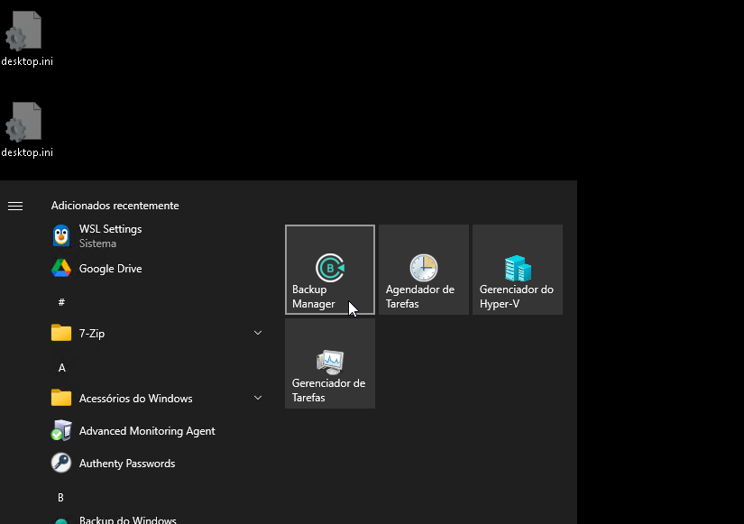
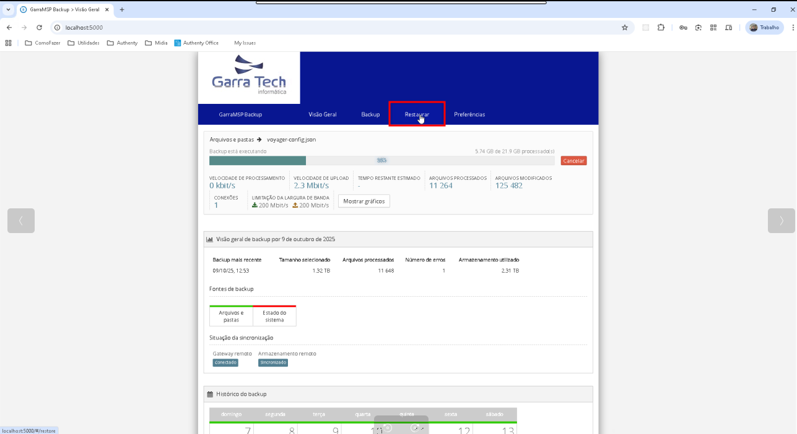
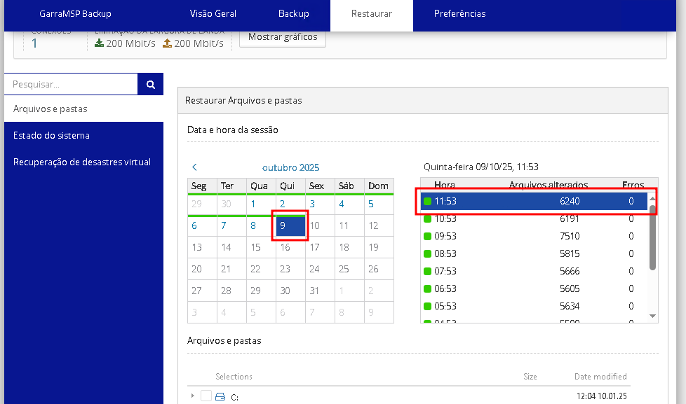
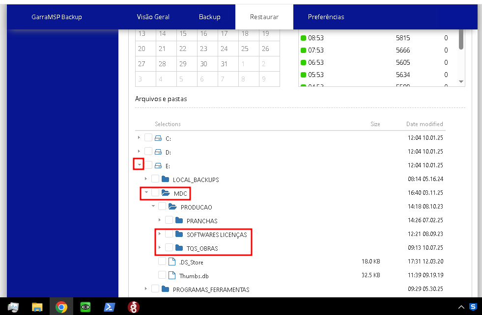
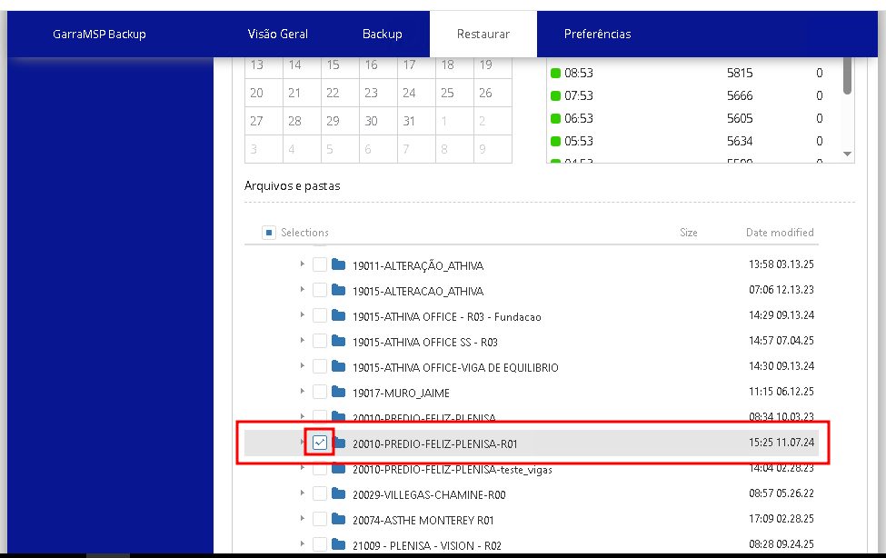
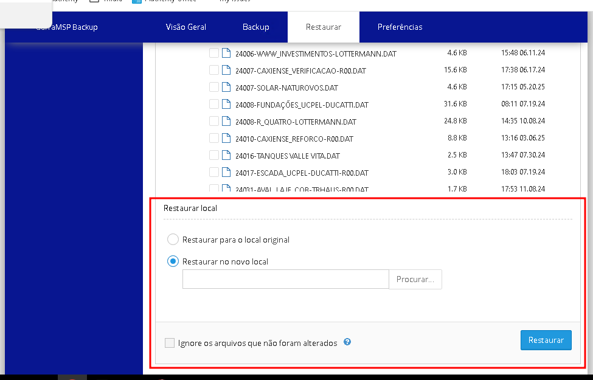

# Como restaurar arquivos e/ou Projetos do Allplan e TQS

Neste tutorial, mostrarei como restaurar arquivos e pastas específicos no `MDCSERVER`.
Lembrando que os projetos do `Allplan` e `TQS CAD` são salvos como pastas, e assim, são recuperados da mesma forma que uma pasta convencional.


## 1: Acesso ao Backup

Somente os sócios da *MDC Projetos* têm acesso ao servidor, portando as credenciais (usuário/senha) necessárias.

O software de recuperação de dados só pode ser acessado localmente, com acesso direto ao `MDC Server`.
O acesso local pode ser feito **Acessando fisicamente o servidor** dentro do armário dele ou **por meio do acesso remoto local pelo RDP**.

- **1:** Uma vez logado no MDCSERVER, como Admin, abra o gerenciador do backup:
  - 

- **2:** Aguarde alguns instantes. Uma janela preta se abrirá (ou piscará) e depois o navegador será aberto na tela do gerenciador de Backup;

- **3:** Uma senha será exigida. Ela está salva nos `G:\Drives compartilhados\Authenty - TI\SENHAS\Server e Infraestrutura\MDCSERVER_Windows10.pswds`, cuja senha também é de conhecimento dos sócios, com o nome de `Backup Garratech`;


## 2: Restauração de pastas e/ou arquivos

- **1:** Acesse a guia "Restaurar":
  - 
- **2:** Selecione o Dia e Horário do qual o arquivo/pasta deve ser recuperado:
  - 
- **3:** Role para baixo, e vá abrindo as pastas até encontrar e selecionar o conteúdo que precisa ser restaurado:
  - 
  - 
- **4:** Role para baixo, até a seção de recuperação:
  - 
- **5:** Selecione agora o modo de recuperação. Existem dois:
  - **Restaurar para o local original**: Neste caso, ao clicar em "Restaurar" todo o conteúdo selecionado será retornado ao estado em que estava no horário selecionado.
    - ```⚠️ Por segurança, eu NÃO aconselho utilizar este modo. Mas se você tiver certeza do que está fazendo, OK.```
  - **Restaurar no novo local**: Restaura o conteúdo para um diretório novo, o qual **você precisará selecionar** clicando em "Browse" e encontrando um local. Eu normalmente uso `E:\RECOVER`.
- **6:** Tendo escolhido a forma de recuperação e o local, clique em "Restaurar"
  - Aguarde o fim da operação (há uma barra de progresso no topo da página);
  - E, de acordo com sua escolha na opção anterior, encontre os arquivos:
    - Se você escolheu `Restaurar para o local original`, já estará tudo no lugar.
    - Se você escolheu `Restaurar no novo local`, abra agora o explorador de arquivos, e acesse a pasta na qual você escolheu restaurar o backup.
      - Ps: Toda a árvore de pastas é recriada, então, um projeto do TQS, por exemplo, estaria salvo em `E:\RECOVER\E\MDC\PRODUCAO\TQS_OBRAS\NOME_DO_PROJETO`.
      - Mova agora seu backup para o local apropriado;
- **7:** Feche o Gerenciador do Backup, bloqueie o computador, e pronto.

---

## Sobre

<div align="center">
  
  
  **Criado por: [William Pilger](https://github.com/williampilger)**  
  *COO | Authenty - Softwares para Engenharia*
  
  🌐 [authenty.com.br](http://authenty.com.br/) | [@authentyAE](https://github.com/authentyAE)  
  
  **Escrito em:** *09 de outubro de 2025, 15:30*  
</div>

---

<div align="center">
  <sub>
    💡 <em>Este tutorial faz parte da coleção de documentações técnicas da <strong>MDC Projetos<strong>.</em><br>
    📚 Encontre mais tutoriais em: <a href="https://github.com/authentyAE/tutoriais-ti">github.com/authentyAE/tutoriais-ti</a>
  </sub>
</div>